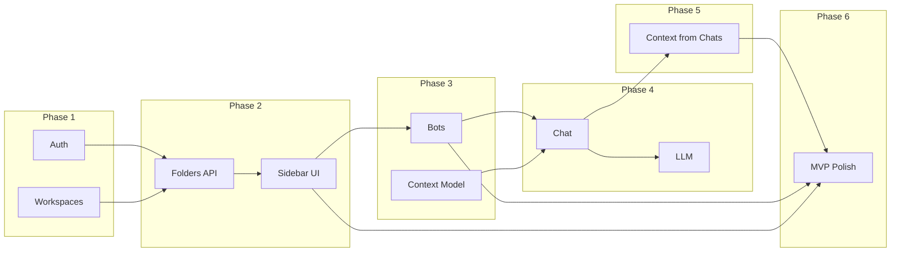

# Chat TOB Roadmap

This roadmap breaks the [VISION](VISION.md) into phases and checkpoints. Each checkpoint is a verifiable outcome.

---

## Tech Stack Assessment

**Next.js (frontend), Node.js + Express (backend), and Prisma + PostgreSQL (database)** are a good fit for Chat TOB.

| Layer | Choice | Why it works |
|-------|--------|--------------|
| **Frontend** | Next.js | Fits the 3-column layout (sidebar + chat + right panel), React component model, and "familiar UX" (VS Code–style, ChatGPT-style). App Router or Pages can both work. |
| **Backend** | Node.js + Express | Enough for REST APIs (workspaces, folders, bots, context, messages, auth). No need for heavy concurrency or non-JS runtimes for the MVP. |
| **Database** | Prisma + PostgreSQL | Prisma models workspace/folder/bot/context/message relations and tree structures (e.g. folder `parentId`) cleanly. PostgreSQL supports recursive CTEs for "folder ancestry" and, with **pgvector**, can store context embeddings if you add semantic search later. |

**Note on embeddings:** For context "embedding (vector)" in VISION §6, store embeddings in Postgres via the **pgvector** extension and Prisma (or raw SQL). That keeps context and vectors in one place; you can defer this to a later phase if MVP uses only folder-scoped context without vector search.

---

## Phase 1: Foundation

**Goal:** Running app, auth, and at least one workspace per user.

- **1.1** Monorepo or two-repo layout: Next.js app and Express API; shared types (e.g. TypeScript) if desired.
- **1.2** PostgreSQL + Prisma: `User`, `Workspace`; user–workspace relation (e.g. "user owns workspaces").
- **1.3** Auth: sign-up / login (e.g. email+password or OAuth); session or JWT; "current user" available to API.
- **1.4** Workspace API: create workspace, list workspaces for user, get one workspace.
- **1.5** Login behavior: if no workspaces → "Create workspace to get started"; if workspaces exist → redirect to last active workspace (store last active workspace id per user).

**Checkpoints:**
- User can sign up, log in, and create a workspace.
- After login, user lands on "create workspace" or last active workspace as per VISION.

---

## Phase 2: Workspace and Folder Structure

**Goal:** Folder tree in data and API, and a VS Code–style sidebar in the UI.

- **2.1** Prisma: `Folder` (e.g. `workspaceId`, `parentId`, `name`, ordering). Recursive tree supported.
- **2.2** Folder API: create folder (root or under parent), list children, get subtree or full tree for a workspace.
- **2.3** Next.js: layout with left sidebar + main content placeholder; workspace switcher (dropdown, list of user's workspaces).
- **2.4** Sidebar: load and display folder tree for current workspace; expand/collapse; create folder (root or under selected folder).

**Checkpoints:**
- User can create and nest folders and see the tree in the sidebar.
- Workspace switcher changes workspace and updates the folder tree.

---

## Phase 3: Bots and Context Model

**Goal:** Bots per folder; context entity and visibility rules in DB and API.

- **3.1** Prisma: `Bot` (e.g. `folderId`, `name`, `description`, `purpose`, `type`: fresh vs context-aware).
- **3.2** Prisma: `Context` (e.g. `workspaceId`, `folderPath` or `folderId`, `title`, `summary`, `sourceBotId`, `sourceFolderPath`, `timestamp`; optional `embedding` later with pgvector).
- **3.3** Context visibility: API that, given a folder id, returns context whose folder is that folder or an ancestor (recursive CTE or path-based).
- **3.4** Bot API: create bot (with optional explicit context selection), list bots in folder, get bot with selected context ids.
- **3.5** Bot creation flow in UI: Step 1 — name, description, purpose, type (fresh / context-aware). Step 2 — for context-aware, show filtered context list (by folder ancestry), user explicitly selects context; no auto-selection.
- **3.6** Sidebar: show bots under each folder; clicking a bot selects it (chat area can still be placeholder).

**Checkpoints:**
- User can create a bot in a folder and, for context-aware bots, explicitly select context from allowed (ancestor) folders.
- Only context from bot's folder and ancestor folders is available for selection.

---

## Phase 4: Chat System and LLM

**Goal:** Persistent conversations per bot, prompt built from system prompt + selected context + history + current message, and one LLM provider (OpenAI) behind an abstraction.

- **4.1** Prisma: `Message` (e.g. `botId`, `role` user/assistant, `content`, `createdAt`); conversation = ordered messages per bot.
- **4.2** Chat API: send message (append user message, call LLM, append assistant message, return stream or full response).
- **4.3** LLM: provider interface (e.g. "complete" or "stream"); OpenAI implementation; no OpenAI-specific logic in feature code.
- **4.4** Prompt construction: system prompt + selected context summaries + chat history + current user message (per VISION §9).
- **4.5** Next.js: main chat area for selected bot; load history; send message; show response (streaming optional).
- **4.6** Right panel: show selected context for current bot and context sources (folder paths); read-only bot settings.

**Checkpoints:**
- User can open a bot, send messages, and get responses with the correct prompt structure.
- Right panel shows which context is used; adding a new provider (e.g. Anthropic) would only touch the provider implementation.

---

## Phase 5: Context From Chats

**Goal:** New context is created automatically from conversations; append-only, no edit/delete in MVP.

- **5.1** After each assistant message (or on a simple heuristic, e.g. end of turn): extract or generate "context" (e.g. title, summary, source bot, folder path, timestamp).
- **5.2** Optional: store embedding for context (e.g. OpenAI embeddings) in Postgres via pgvector for future search; not required for MVP if selection is only by folder.
- **5.3** Persist new context; associate with workspace and folder; do not allow edit/delete in MVP.
- **5.4** Ensure visibility rules: new context is only available to bots in the same folder or ancestor folders.

**Checkpoints:**
- Chatting with a bot creates context entries that appear in the Context Manager and in the selection list for context-aware bots in allowed folders.
- Context is append-only and immutable in MVP.

---

## Phase 6: Polish and MVP Complete

**Goal:** UX and behavior match VISION; MVP success criteria met.

- **6.1** "Last active workspace" and "last active bot" (or first bot) so returning users land in a sensible place.
- **6.2** UI clarity: indicate in chat or right panel which context is being used; no hidden context.
- **6.3** Collapsible right panel; stable layout (sidebar + chat + panel).
- **6.4** Validation: multiple workspaces, repo-like folder structure, multiple bots per folder, explicit context selection, auto context from chat, intuitive UI.

**Checkpoints:**
- All MVP success criteria from VISION §14 are satisfied.
- No scope creep: no RBAC, workflow engine, analytics, or context edit/delete.

---

## Phase Dependencies

